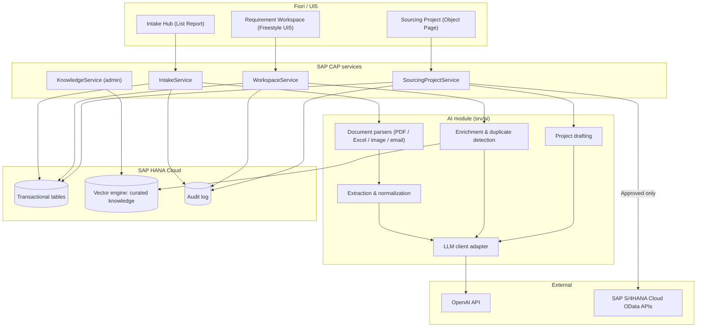
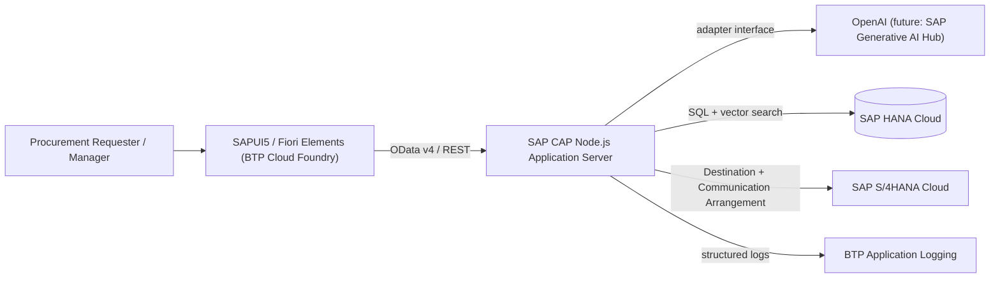
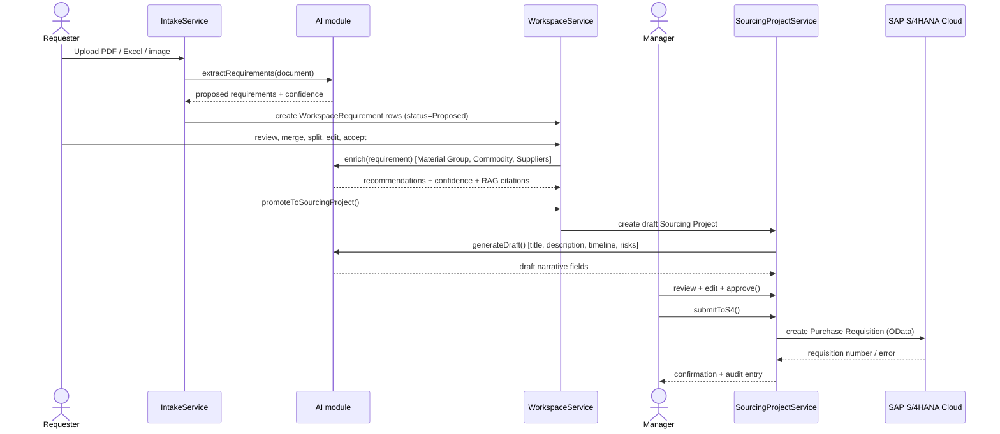
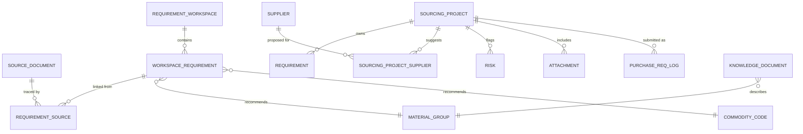

# AI Procurement Assistant — Solution Architecture

Design draft for the target PoC: an AI-assisted intake and enrichment layer that turns scattered procurement requirements (email, PDF, images, Excel, partner REST feeds) into a human-reviewed Sourcing Project and, on approval, a Purchase Requisition in SAP S/4HANA Cloud. AI proposes; a human (Procurement Requester, then Procurement Manager) always decides.

> **Status**: design draft, not yet implemented. The current repo (see [`CLAUDE.md`](../CLAUDE.md)) is a generic document-upload/RAG-chat scaffold — a technical template for ingestion and vector search, not this domain. This document is the target architecture that `srv/`, `db/schema.cds`, and `app/` should grow into, phase by phase (§29, §30).

## 1. Executive summary

Procurement requirements arrive scattered across inboxes, PDFs, scanned images, spreadsheets, and partner systems. Turning that into a well-formed Sourcing Project is manual, slow, and inconsistent. This PoC adds an AI-assisted intake/enrichment layer in front of the Sourcing Project → Purchase Requisition process: AI extracts and proposes, a **Requirement Workspace** lets a human merge/edit/confirm, and only an approved, human-owned Sourcing Project is ever sent to SAP S/4HANA Cloud.

The design stays inside CAP's own capabilities — no message broker, no agent framework, no knowledge graph. SAP HANA Cloud's native vector engine covers retrieval; a single adapter interface isolates the LLM provider so the PoC can start on OpenAI and move to SAP AI Core / Generative AI Hub without touching business logic.

## 2. Business architecture

Three roles: **Procurement Requester** (imports source material, curates the Workspace, drafts the Sourcing Project), **Procurement Manager** (reviews, approves, and is the only role allowed to trigger Purchase Requisition creation), **Knowledge Curator** (maintains the curated RAG corpus — policies, Material Group catalog, commodity taxonomy, supplier profiles).

| Capability                   | Owned by          | AI's role                                                        |
| ---------------------------- | ----------------- | ---------------------------------------------------------------- |
| Import requirements          | Requester         | Parses documents, extracts structured fields                     |
| Curate Requirement Workspace | Requester         | Proposes merges/duplicates/enrichment — never applies silently   |
| Draft Sourcing Project       | Requester         | Generates title, description, timeline, priority, risk narrative |
| Approve Sourcing Project     | Manager           | None — approval is exclusively human                             |
| Create Purchase Requisition  | Manager           | None — CAP calls S/4HANA directly; AI has no path to it          |
| Curate RAG knowledge base    | Knowledge Curator | None — curation is a deliberate, reviewed act                    |

## 3. End-to-end process flow

1. **Import source** — upload or receive a document/API payload; a `SourceDocument` record is created.
2. **Extract** — AI parses the source and proposes structured requirements with a confidence score per field.
3. **Normalize** — descriptions, units, and quantities are standardized against the curated catalog.
4. **Detect duplicates** — embedding + structured similarity flags likely duplicates across sources; never auto-merged.
5. **Enrich** — AI recommends Material Group, Commodity Code, and candidate suppliers, grounded via RAG.
6. **Human review** — the Requester edits, merges, splits, accepts, or rejects each Workspace item.
7. **Generate draft Sourcing Project** — AI drafts title, description, timeline, priority, and risks from accepted items.
8. **User approval** — the Procurement Manager reviews every field and approves.
9. **Create Purchase Requisition** — CAP validates and calls SAP S/4HANA Cloud's OData API; the result is logged and shown to the user.

## 4. Solution architecture

| Layer        | Responsibility                                                   | Technology                                               |
| ------------ | ---------------------------------------------------------------- | -------------------------------------------------------- |
| Presentation | Upload, review, approve                                          | SAPUI5 / Fiori Elements, Build Work Zone (optional)      |
| Application  | Domain logic, workflow gates, validation                         | SAP CAP (Node.js)                                        |
| AI           | Extraction, normalization, enrichment, drafting — proposals only | OpenAI (PoC) behind an internal adapter                  |
| Integration  | Master data lookups, Purchase Requisition creation               | SAP S/4HANA Cloud OData APIs via BTP Destination service |
| Data         | Transactional data, curated knowledge, vectors, audit trail      | SAP HANA Cloud (SQLite for dev)                          |

## 5. Component diagram



## 6. High-level architecture diagram



Everything the Requester and Manager touch goes through CAP. Neither the LLM provider nor the browser ever calls SAP S/4HANA Cloud directly.

## 7. Sequence diagram



## 8. CAP project structure (target)

```
poc_sp_hub/
├── db/
│   ├── schema.cds            # domain model (namespace: sourcing)
│   └── data/                 # curated knowledge seed CSVs
├── srv/
│   ├── intake-service.cds / .js
│   ├── workspace-service.cds / .js
│   ├── sourcing-project-service.cds / .js
│   ├── knowledge-service.cds / .js      # admin-only, curated corpus
│   ├── s4-integration/
│   │   ├── purchase-requisition.js      # remote service + payload mapping
│   │   └── master-data.js               # material group / plant lookups
│   └── ai/
│       ├── llm-client.js                # provider adapter (OpenAI today)
│       ├── document-parsers/            # pdf, excel, image(ocr), email
│       ├── extraction.js
│       ├── enrichment.js
│       ├── duplicate-detection.js
│       └── project-drafting.js
├── app/
│   ├── intake-hub/                      # Fiori Elements LROP (reuses existing document-manager pattern)
│   ├── requirement-workspace/           # Freestyle SAPUI5
│   └── sourcing-project/                # Fiori Elements Object Page (draft-enabled)
└── test/data/                           # sample source documents + expected extractions
```

The existing `document-manager` app and `DocumentService` are kept as the template for the intake pattern (upload → chunk → status) rather than replaced — `IntakeService` follows the same shape.

## 9. Domain model



Two families of documents must not be confused: **SourceDocument** (raw, per-project intake — email/PDF/image/Excel, parsed once and not permanently vectorized) and **KnowledgeDocument** (curated, long-lived, deliberately indexed into the vector store). Only the latter feeds RAG.

## 10. CDS entity model (target, namespace `sourcing`)

```cds
namespace sourcing;
using { cuid, managed } from '@sap/cds/common';

entity SourceDocument : cuid, managed {
  originType    : String(10) enum { Email; Pdf; Image; Excel; RestApi };
  fileName      : String(255);
  fileType      : String(10);
  status        : String(20) default 'UPLOADED'; // UPLOADED, EXTRACTING, EXTRACTED, FAILED
  errorMsg      : String(1000);
  workspace     : Association to RequirementWorkspace;
}

entity RequirementWorkspace : cuid, managed {
  title          : String(200);
  status         : String(20) default 'OPEN'; // OPEN, MERGED, ARCHIVED
  sourcingProject: Association to SourcingProject;
  documents      : Composition of many SourceDocument on documents.workspace = $self;
  items          : Composition of many WorkspaceRequirement on items.workspace = $self;
}

entity WorkspaceRequirement : cuid, managed {
  workspace             : Association to RequirementWorkspace @mandatory;
  description           : String(1000);
  normalizedDescription : String(1000);
  quantity              : Decimal(15,3);
  unit                  : String(10);
  requestedDate         : Date;
  materialGroup         : Association to MaterialGroup;
  commodityCode         : Association to CommodityCode;
  confidenceScore       : Decimal(3,2);            // 0.00 – 1.00
  aiStatus              : String(10) default 'PROPOSED'; // PROPOSED, ACCEPTED, EDITED, REJECTED
  duplicateOf           : Association to WorkspaceRequirement;
  sources               : Composition of many RequirementSource on sources.requirement = $self;
}

entity RequirementSource : cuid {
  requirement : Association to WorkspaceRequirement @mandatory;
  document    : Association to SourceDocument @mandatory;
  rawSnippet  : LargeString;
  location    : String(100); // page / cell / paragraph reference
}

entity SourcingProject : cuid, managed {
  title              : String(200);
  description         : LargeString;
  category            : String(50);
  materialGroup       : Association to MaterialGroup;
  status              : String(20) default 'DRAFT'; // DRAFT, APPROVED, SUBMITTED
  priority            : String(10);
  timelineStart       : Date;
  timelineEnd         : Date;
  budgetAmount        : Decimal(15,2);
  budgetCurrency      : String(3);
  requirements        : Composition of many Requirement on requirements.project = $self;
  commodityCodes      : Composition of many SourcingProjectCommodity on commodityCodes.project = $self;
  suggestedSuppliers  : Composition of many SourcingProjectSupplier on suggestedSuppliers.project = $self;
  risks               : Composition of many Risk on risks.project = $self;
  attachments         : Composition of many Attachment on attachments.project = $self;
  requisitionLog      : Composition of many PurchaseReqLog on requisitionLog.project = $self;
}

entity Requirement : cuid {
  project     : Association to SourcingProject @mandatory;
  description : String(1000);
  quantity    : Decimal(15,3);
  unit        : String(10);
  aiGenerated : Boolean default false;
}

entity KnowledgeDocument : cuid, managed {
  category  : String(30); // Policy, MaterialGroupCatalog, CommodityTaxonomy, PastProject, SupplierProfile, Guideline
  title     : String(200);
  content   : LargeString;
  embedding : Vector(3072);
  sourceRef : String(255);
}

entity AuditLog : cuid {
  entityName : String(60);
  entityId   : UUID;
  action     : String(30);
  actor      : String(255);
  aiInvolved : Boolean default false;
  before     : LargeString;
  after      : LargeString;
  timestamp  : Timestamp @cds.on.insert: $now;
}
```

Reference/master entities (`MaterialGroup`, `CommodityCode`, `Supplier`, `SourcingProjectCommodity`, `SourcingProjectSupplier`, `Risk`, `Attachment`, `PurchaseReqLog`) follow the same conventions — each a straightforward `cuid`/`managed` entity with a handful of scalar fields — and are omitted here for brevity.

## 11. Database design

- **SQLite** for local development (`@cap-js/sqlite`), **SAP HANA Cloud** in test/production (`@cap-js/hana`) — matches the existing repo's profile split.
- **Vector storage lives in HANA Cloud's native vector engine** (the `Vector(3072)` column already present in the repo's schema for OpenAI's `text-embedding-3-large`). No separate vector database.
- `KnowledgeDocument` is the only table indexed for similarity search. `SourceDocument`/`RequirementSource` content is chunked for extraction but not retained as long-lived vectors once extraction completes.
- `AuditLog` is append-only; no entity is hard-deleted once it has left `DRAFT` status — status transitions (`ARCHIVED`, `REJECTED`) are used instead.

## 12. CAP services

| Service                | Path                     | Key operations                                                                                            |
| ---------------------- | ------------------------ | --------------------------------------------------------------------------------------------------------- |
| IntakeService          | `/api/intake`            | `uploadDocument`, `extractRequirements(id)`, `getExtractionStatus(id)`                                    |
| WorkspaceService       | `/api/workspace`         | CRUD + `merge(ids)`, `split(id)`, `reject(id)`, `regenerate(id)`, `promoteToSourcingProject(workspaceId)` |
| SourcingProjectService | `/api/sourcing`          | CRUD + `generateDraft(id)`, `approve(id)`, `submitToS4(id)`                                               |
| KnowledgeService       | `/api/knowledge` (admin) | `indexDocument`, `reindex`, `listByCategory`                                                              |

Each service is a thin CAP `ApplicationService` that calls into `srv/ai/*` or `srv/s4-integration/*` — the AI module knows nothing about OData/HTTP, and the S/4 integration module knows nothing about prompts, keeping both testable in isolation.

## 13. REST/OData integration design

- Fiori apps talk to CAP over **OData v4** (generated from the CDS services above), matching the existing `document-manager` app's pattern.
- Partner systems submit structured requirements over a **custom REST endpoint** on `IntakeService` (`originType = RestApi`) — these bypass document parsing entirely and go straight to normalization.
- CAP calls SAP S/4HANA Cloud exclusively via its **released public OData APIs** (Purchase Requisition, Material Group, Purchasing Group/Org, Plant) through a BTP **Destination** backed by a **Communication Arrangement** — no direct host/credential configuration in code.

> **Gap closed**: the original spec listed "Custom REST APIs" once as an input source and once as an integration technology without distinguishing direction. Resolved: inbound REST is a structured intake channel; outbound integration to S/4HANA is OData-only.

## 14. AI architecture

A single `llm-client.js` adapter exposes `chat(prompt, schema)` and `embed(text)`, implemented against OpenAI today. Every AI capability (extraction, enrichment, duplicate detection, drafting) calls this adapter, never the OpenAI SDK directly — swapping to SAP AI Core / Generative AI Hub later means implementing the same interface once, not touching five call sites. All AI calls are single, bounded, stateless invocations orchestrated by CAP application code — there is no agent loop deciding what to do next (see §25).

## 15. RAG architecture

RAG is scoped narrowly to five curated `KnowledgeDocument` categories: procurement policies, the Material Group catalog, commodity taxonomy, past Sourcing Projects, and supplier profiles/guidelines. Retrieval is cosine similarity over HANA Cloud's vector engine, top-k (k≈5–8), injected into enrichment/drafting prompts as grounding context with citations back to `sourceRef`.

> **Deliberate exclusion**: uploaded `SourceDocument` content (the email/PDF/Excel a requirement came from) is **not** added to this vector store. It's parsed once for extraction and kept for traceability, not retrieval — indexing every upload would pollute recommendations with one-off, uncurated text.

## 16. Prompt engineering strategy

| Task                                               | Temperature | Output contract                                                                                   |
| -------------------------------------------------- | ----------- | ------------------------------------------------------------------------------------------------- |
| Extraction                                         | 0.0–0.2     | Strict JSON schema (validated server-side); unparseable output retried once, then marked `FAILED` |
| Normalization / duplicate detection                | 0.0–0.2     | JSON with explicit `confidence` and `rationale` fields                                            |
| Enrichment (Material Group / Commodity / Supplier) | 0.2–0.4     | JSON list of ranked candidates, each with `confidence` and a RAG citation                         |
| Project drafting (title, description, risks)       | 0.4–0.6     | JSON with named fields — no field is ever written directly from unstructured free text            |

Every system prompt opens with: _"You propose values for a human to review. You never decide, approve, or submit anything."_ Each task has its own prompt template and few-shot examples drawn from curated knowledge, not hardcoded in application code.

## 17. Document processing flow

| Source   | Parsing approach                                                                                          |
| -------- | --------------------------------------------------------------------------------------------------------- |
| Email    | Forwarded/uploaded `.eml` parsed for body + attachments; each attachment becomes its own `SourceDocument` |
| PDF      | Text-layer extraction first; OCR fallback only if no text layer is present                                |
| Image    | OCR / vision-capable model extraction                                                                     |
| Excel    | Deterministic row/column parsing; AI normalizes free-text cells only, never re-derives structured ones    |
| REST API | Already structured — skips parsing, goes straight into normalization                                      |

> **Scope decision needed**: the spec doesn't say whether email ingestion means live mailbox polling or manual upload of exported messages. The PoC (§30) treats email as manual upload/forward, deferring live inbox automation.

## 18. Requirement extraction flow

`SourceDocument` → parsed text/chunks → LLM extraction against a JSON schema (`description`, `quantity`, `unit`, `requestedDate`, `rawSnippet`) → a `WorkspaceRequirement` row per identified need, status `PROPOSED`, with a `RequirementSource` row linking back to the exact chunk/page/cell it came from. Field-level confidence scores aggregate into `confidenceScore`.

## 19. Requirement Workspace design

The Workspace is the only place AI output can be edited before it becomes a Sourcing Project.

| Action               | Effect                                                                               |
| -------------------- | ------------------------------------------------------------------------------------ |
| Edit                 | Inline field edit; sets `aiStatus = EDITED`, never overwritten by a later regenerate |
| Merge                | Combines selected rows into one, unioning their `RequirementSource` links            |
| Split                | Duplicates a row so quantity/description can be divided across two requirements      |
| Delete               | Soft-delete, recorded in `AuditLog`                                                  |
| Reject AI suggestion | Clears the AI-proposed value; field left blank for manual entry                      |
| Regenerate           | Re-invokes enrichment for that single row only — never bulk                          |

Confidence badges: **≥ 0.80 high**, **0.50–0.79 medium**, **< 0.50 low**. A Workspace cannot be promoted to a Sourcing Project while any item below 0.50 is unreviewed.

## 20. Sourcing Project generation flow

Accepted `WorkspaceRequirement` rows are copied — not referenced — into the new `SourcingProject` as `Requirement` rows, so later Workspace edits can never retroactively alter an already-drafted project. `generateDraft()` asks the AI module to propose title, description, timeline, priority, and a risk narrative, grounded via RAG. Every generated field is fully editable and marked `aiGenerated = true` until a human edits it.

## 21. SAP S/4HANA integration

- **Outbound**: Purchase Requisition creation via the public Purchase Requisition OData API, called only from `SourcingProjectService.submitToS4` — the single choke point that talks to S/4HANA.
- **Inbound (read-only)**: Material Group, Purchasing Group/Org, Plant, and currency master data, cached locally and refreshed periodically, used to validate a project's fields _before_ submission.
- **Mapping & validation**: CAP maps `SourcingProject` + `Requirement` rows to the PR header/item payload, validates locally, then calls S/4HANA. Every attempt — success or failure — is written to `PurchaseReqLog`.

> **Gap closed**: the original spec didn't mention that PR creation needs validated Material Group/Plant/Purchasing Group master data first — added as a required read-only integration, not just the PR write.

## 22. Security and authorization

| Role                   | Permissions                                             |
| ---------------------- | ------------------------------------------------------- |
| `ProcurementRequester` | Import, curate Workspace, draft Sourcing Projects       |
| `ProcurementManager`   | All Requester permissions + approve + submit to S/4HANA |
| `KnowledgeCurator`     | Manage the curated RAG corpus only                      |
| `Viewer`               | Read-only                                               |

Enforced with CAP's `@requires`/`@restrict` annotations, backed by XSUAA role collections in production and mocked users locally — following the existing `[production].auth: xsuaa` profile split in `package.json`. Object-level checks ensure only a project's owner or a manager can edit it. Secrets (OpenAI key, S/4 destination credentials) live in the BTP Destination/credential-store service, never in code or committed env files.

## 23. Error handling strategy

| Layer                 | Handling                                                                                                                                  |
| --------------------- | ----------------------------------------------------------------------------------------------------------------------------------------- |
| Input validation      | 400 with field-level messages; bad file types rejected before parsing                                                                     |
| AI/extraction failure | Retry once with a stricter prompt; otherwise `SourceDocument.status = FAILED` with `errorMsg` set — other documents unaffected            |
| S/4HANA integration   | Transient errors (5xx/timeout) retried with backoff, max 3; business/validation errors (400) surfaced to the user, never silently retried |
| All layers            | Every error carries a correlation ID and is logged — no silent failures                                                                   |

Extends the pattern already used for `errorMsg` on the existing `Documents` entity.

## 24. Logging and monitoring

Structured JSON logging (`cds.log`) with a correlation ID per request, split into categories: `ai.extraction`, `ai.enrichment`, `integration.s4`, `audit`. AI log entries capture prompt template ID, token usage, latency, and confidence — never full prompt/PII content in plain text. Shipped to **BTP Application Logging** for Cloud Foundry; no bespoke monitoring UI for the PoC.

## 25. AI guardrails

- The AI module holds no credentials or code path to SAP S/4HANA — only `SourcingProjectService.submitToS4` can call it, gated by `ProcurementManager` role and `status = APPROVED`.
- Every AI-written field carries `confidenceScore`, provenance (`rawSnippet`/citation), and an `aiGenerated` flag.
- A human edit permanently marks a field `EDITED`; regeneration never silently overwrites an edited value.
- All AI output is validated against a strict JSON schema before persistence.
- No autonomous multi-step chains: every AI capability is one bounded call orchestrated by CAP.
- Per-call token caps and a configurable daily cost budget bound OpenAI spend.

## 26. Fiori/UI5 application structure

- **Intake Hub** — Fiori Elements List Report/Object Page, extending the existing `document-manager` generator pattern: upload, per-document extraction status, raw extraction preview.
- **Requirement Workspace** — Freestyle SAPUI5 (merge/split/inline-edit/confidence badges don't fit generated CRUD templates): a table with a multi-select toolbar (Merge, Split, Delete, Regenerate, Reject) and a side panel showing source traceability.
- **Sourcing Project** — Fiori Elements Object Page (draft-enabled), sections mirroring the field groups (General, Requirements, Suppliers, Timeline & Budget, Risks, Attachments), Approve/Submit-to-S4 as role-gated header actions.

## 27. Suggested navigation

Launchpad Home → _Import Requirements_ (Intake) · _Requirement Workspace_ (badge = items needing review) · _Sourcing Projects_ (grouped by status). Intake Object Page → "Send to Workspace" deep-links into the Workspace pre-filtered. Workspace → "Create Sourcing Project" deep-links to a new draft Object Page. Sourcing Project → Approve → Submit to S4 → confirmation dialog shows the resulting requisition number.

## 28. UX / user journey

| Step | Persona          | Action                                                                    | System response                                                        |
| ---- | ---------------- | ------------------------------------------------------------------------- | ---------------------------------------------------------------------- |
| 1    | Maria, Requester | Uploads 3 emailed requests, a supplier PDF, an Excel BOM                  | Four `SourceDocument` rows created, extraction starts                  |
| 2    | Maria            | Opens Requirement Workspace                                               | Sees 11 proposed requirements, 2 flagged as likely duplicates          |
| 3    | Maria            | Merges duplicates, edits two quantities, rejects one low-confidence guess | Workspace reduces to 9 confirmed items                                 |
| 4    | Maria            | Promotes Workspace to a Sourcing Project                                  | AI drafts title, description, timeline, priority, risks                |
| 5    | Julia, Manager   | Reviews the draft, adjusts the timeline                                   | Approves the project                                                   |
| 6    | Julia            | Submits to S/4HANA                                                        | Purchase Requisition `4500001234` created, logged, confirmed on screen |

## 29. Development roadmap

| Phase                           | Delivers                                                                          |
| ------------------------------- | --------------------------------------------------------------------------------- |
| 0 — Baseline                    | Existing repo: generic document/chunk/chat scaffold                               |
| 1 — Domain foundation           | Sourcing domain model, manual PDF/Excel/image intake, CRUD only, no AI            |
| 2 — Extraction                  | OpenAI-backed extraction + normalization + confidence scoring                     |
| 3 — Enrichment                  | RAG-backed Material Group/Commodity/Supplier recommendations, duplicate detection |
| 4 — Sourcing Project generation | Draft generation, approval gate, Requirement Workspace UX complete                |
| 5 — S/4HANA integration         | Master data validation + Purchase Requisition creation                            |
| 6 — Hardening                   | Roles/authorization, logging/monitoring, guardrail tuning                         |
| 7 — Optional extensions         | Work Zone launchpad packaging, live email ingestion, AI Core/Gen AI Hub migration |

## 30. PoC scope

**In scope**: manual upload of PDF/Excel/image (no live mailbox polling); OpenAI-backed extraction and enrichment; HANA Cloud vector engine RAG over a small curated set (~50–200 documents); single S/4HANA Cloud test tenant, Purchase Requisition creation only; two roles (Requester, Manager); one sourcing category to bound testing (e.g. indirect/equipment).

**Out of scope (deferred)**: live email inbox integration; SAP Build Work Zone launchpad packaging; multi-tenancy; supplier RFx/negotiation; OCR for handwritten documents; downstream tracking beyond Purchase Requisition (PO, goods receipt, invoice).

## 31. Future enhancements

- Swap the LLM adapter to **SAP Generative AI Hub** for model-agnostic orchestration and EU data residency.
- Move to **SAP AI Core** with fine-tuned extraction models if generic-model accuracy proves insufficient for domain-specific documents.
- Feedback loop where Manager corrections retrain the few-shot example library.
- Supplier RFx generation once the core intake-to-PR flow is proven.
- Multi-language extraction for non-English source documents.
- Joule and SAP Build Process Automation integration — deliberately deferred, not part of this PoC.
